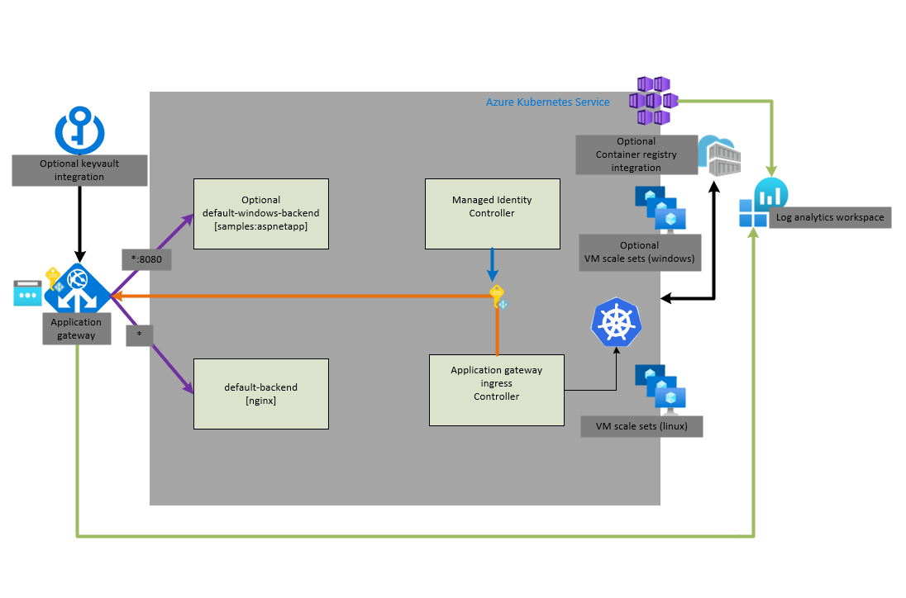

# AksKickStarters
A pulumi project to spin up an azure kubernetes service with the following properties/services out of the box:
- [Application gateway ingress controller](https://docs.microsoft.com/en-us/azure/application-gateway/ingress-controller-overview)
- [AAD pod identity](https://github.com/Azure/aad-pod-identity)
- [Kubernetes Event-driven Autoscaling](https://keda.sh/)
- [Azure Monitor for containers](https://docs.microsoft.com/en-us/azure/azure-monitor/insights/container-insights-overview)
- [Diagnostic logs for Application gateway](https://docs.microsoft.com/en-us/azure/application-gateway/application-gateway-diagnostics)
- [Ephemeral nodes](https://docs.microsoft.com/en-us/azure/aks/cluster-configuration#ephemeral-os), [Auto scaling](https://docs.microsoft.com/en-us/azure/aks/cluster-autoscaler), and [Azure CNI](https://docs.microsoft.com/en-us/azure/aks/configure-azure-cni)
- [Azure Container Registry](https://azure.microsoft.com/en-us/services/container-registry/)

## Pre-Requisites
- [NodeJs](https://nodejs.org/en/)
- [Pulumi cli](https://www.pulumi.com/docs/get-started/azure/begin/)
- [Azure cli](https://docs.microsoft.com/en-us/cli/azure/install-azure-cli)
- [Kubectl](https://kubernetes.io/docs/tasks/tools/install-kubectl/)
- [Helm](https://helm.sh/docs/intro/install/)
- An [Azure](https://azure.microsoft.com/en-us/free/) subscription and an account with permissions to assign permissions

## Getting started
Ensure that the azure cli is logged in and that you have selected the subscription you want to use:
```
az login
az account set -s <your-subcription-id>
```

Ensure you are logged in to pulumi:

```
pulumi login
```
Clone the project and start deployment:

```
git clone https://github.com/Ibis-Software/AksKickStarters.git

cd AksKickStarters/infrastructure

npm install

pulumi stack init dev

pulumi up 
```
Confirm update, and after a while the deployment should be done and you should see an output simular to this `publicIPAddress: "40.74.34.86"`.
If you visit that address you should see the default nginx welcome page.

<!-- markdownlint-disable MD033 -->
<p>
<details>
  <summary>&#x261d; &#xfe0f; Tip: Working in a shared Azure subscription</summary>
<ul>  
  <p>If you are working in a shared Azure subscription you can override the default resource group name to cater for individual resource group names. See section <a href="#Configuration">Configuration</a> in this document.</p><p>The resource group name is controlled with the <a href="https://github.com/Ibis-Software/AksKickStarters/blob/master/infrastructure/Pulumi.dev.yaml#L7">akskickstart:name</a> setting<p>
</ul>
</details>
</p>
<!-- markdownlint-enable MD033 -->

After the deployment two resource groups (rg-akskickstart-dev, rg-akskickstart-dev-nodes) are created. Here is a schematic overview of the resources deployed:



## Optional steps 
After adding the optional items you want you should run `pulumi up` to update your deployment. 

### Add SSL certificates from Keyvault
You can link you wildcard ssl certificates from keyvault by adding them to the pulumi configuration.   
```
pulumi config set --path pulumi config set --path keyVaultResourceId /subscriptions/<subscriptionId>/resourceGroups/<resourceGroup>/providers/Microsoft.KeyVault/vaults/<keyvault-name>

pulumi config set --path "sslCertificates[0].name" <ssl-certificate-name>

pulumi config set --path "sslCertificates[0].secret" https://<keyvault-name>.vault.azure.net/secrets/<certificate-name> --secret
```

You should then be able to create an ingress to use the certificate as follows:
```
apiVersion: extensions/v1beta1
kind: Ingress
metadata:
  name: aspnetapp
  annotations:
    kubernetes.io/ingress.class: azure/application-gateway
    appgw.ingress.kubernetes.io/appgw-ssl-certificate: <ssl-certificate-name>
    appgw.ingress.kubernetes.io/ssl-redirect: "true"
spec:
  rules:
  ...
```

### Link Azure Container Registry
You can specify an existing container registry to use in the deployment.

first, it is recommended to disable the deployment of the default container registry. See [Configuration](#Configuration) on how to do this.

 To use an existing container run the following command:
```
pulumi config set --path acrResourceId /subscriptions/<subscriptionId>/resourceGroups/<resourceGroup>/providers/Microsoft.ContainerRegistry/registries/<registry-name>
```

### Add windows node pool
You can add a windows node pool by running the following command:

```
pulumi config set --path windows.enabled true
```

## Configuration

Basic configuration is defined in the [configuration file](infrastructure/Pulumi.dev.yaml). Values can be overridden using `pulumi config set --path [configuration-setting-name] [value]`. E.g.: `pulumi config set --path kskickstart:includeContainerRegistry "false"`.

### Available settings:
| Name  |Default Value   |Description   |
|---|---|---|
|applicationGatewayTier   |Standard_v2   |[Tier to use for the Application Gateway](https://azure.microsoft.com/en-us/pricing/details/application-gateway/). Accepted values: Standard_Small, Standard_Medium, Standard_Large, WAF_Medium, WAF_Large, Standard_v2, WAF_v2   |
|defaultImage   |nginx   |The docker image to use for the demo pod   |
|windows.enabled   |false   |It true, a windows node pool will be provisioned as well   |
|includeContainerRegistry   |"true"   |Whether or not a container registry should be provisioned during the deployment. Set this to false to [attach an existing registry](#Link-Azure-Container-Registry).   |
|kubernetesVersion   | 1.20.7   |The kubernetes version to deploy   |
|location   | WestEurope   |Azure region to deploy to |
|name   | akskickstart   |Name of the pulumi stack. Also used in the name of the Azure resource group |
|keyVaultResourceId   |\<none>     |Id of an Azure Key Vault resource. E.g.: `/subscriptions/<subscriptionId>/resourceGroups/<resourceGroup>/providers/Microsoft.KeyVault/vaults/<keyvault-name>`|
|sslCertificates[0].name   |\<none>     |Name of the SSL certificate to use. See [the SSL section](#Add-SSL-certificates-from-Keyvault)|
|sslCertificates[0].secret   |\<none>     |Reference to the Key Vault secrert, E.g.: `https://<keyvault-name>.vault.azure.net/secrets/<certificate-name>`. See [the SSL section](#Add-SSL-certificates-from-Keyvault)|

## Clean up

To remove the provisioned resource, run `pulumi destroy --preserve-config`. The --preserve-config flag prevents the configuration file from being removed as well in the process.

## Issues

- Runnning `pulumi destroy` will give you the following error  `error: 'azureassignedidentities.aadpodidentity.k8s.io' timed out waiting to be Ready`. The only way to get arround this is to export the stack and remove the offending item and then import the stack again. See [pulumi stack](https://www.pulumi.com/docs/reference/cli/pulumi_stack/) for more info.
